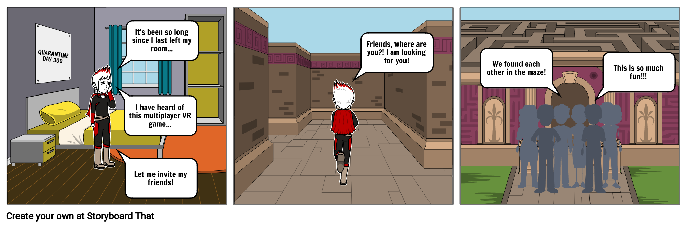
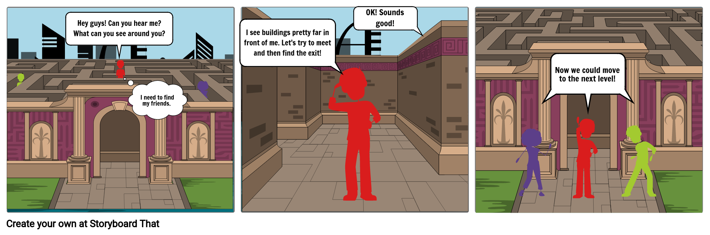

# aMAZEing

*Some of you may be lost in these troubling times, but why not get lost together?*

This project is a multiplayer game where players work together to find their way inside a maze. They can use the landmarks placed inside and around the maze as points of reference to help with directions; they can also communicate with each other via audio chat to share information.

## What we wanted to accomplish

When presented with the task to come up with a project idea in October 2020, we were in the middle of the COVID-19 pandemic. We looked at our experiences dealing with the situation, and we realized a few things:

- The constant isolation we have been living in has significantly decreased our social interactions
- With fewer social interactions, the individuals have been feeling more lonely
- Overall, this environment has lead to an increase in cases of depression and anxiety across the whole population

This is why we decided to build a game that would allow people to find something to entertain themselves during isolation, while also giving them a chance to interact with different people to hopefully form a bond and have a virtual break from the loneliness we have all been feeling.

## How we accomplished it

Here you can see two storyboards to represent the core features of our application: a user walking around the maze, the ability to communicate with the other players, and the landmarks inside and outside of the maze.

Users can enter and walk around the maze to find the rest of the team and reach the exit.


Users can communicate with the rest of the team and look at the landmarks to find their way through the maze.


### Features

TODO ADD PICTURES

- A basic environment with a maze
- A menu to start the game
- Users can move in the environment
- Users can interact with each other
- The maze has a finish point
- Each user needs to reach the finish point in order to win
- Users spawn in different spots of the maze
- The maze has landmarks to aid the players

### Architecture and Data Flow

This project uses Babylon.js to render the game environment, and Colyseus for the multiplayer game logic. The audio communication is implemented using WebRTC.

TODO ADD FIRST DIAGRAM

On the server side, we have two servers both running on Node.js. We have a game server consisting of two modules, one module providing audio chat functionality with WebRTC, the other one implementing the game logic with Colyseus. Colyseus is a framework that provides state synchronization between different clients. The second server is the web server, which simply hosts the client's JavaScript code. Both servers are hosted on the same Amazon EC2 instance when demoing remotely.

Both client and server code is written in TypeScript.

TODO ADD SECOND DIAGRAM

The client (user) sits in the middle of the data flow. For the audio chat part, the clients will send a WebRTC signal to the WebRTC server, which will respond with the other clients' port and address information. Then, the clients will establish a peer-to-peer connection with each other, without further need to talk to the WebRTC server. For the game state synchronization part, the clients will post their actions (e.g. keyboard presses) to the Colyseus server, which runs the game logic. The server will then calculate the new state and push it to the clients. It is important to note there is only one authoritative game logic running on the server: the action is going one-direction from client(s) to server, the updated state is also going one-direction from server to clients.

## How to get started

TODO ADD LINKS TO REPOSITORY STRUCTURE + MAIN COMPONENTS. NEED REFACTORING TO BE DONE BEFORE EDITING

Our repository structure is divided into two main directories:
- [server](./server)
- [client](./client)
The [readme_pics](./readme_pics) directory just contains the pictures rendered in this README.

Both the `server` and `client` directories have their own `package.json` as they are two environments saparate from each other, as outlined in the architecture diagrams.

The relevant files of `server` are all stored in `server/src`:
- [index.ts](./server/src/index.ts) - is the main driver for the server code
- [assets/](./server/src/assets) - the graphic components of the game, like the maze itself, the avatars used to represent the players, and the landmarks
- [audio/Signaling.ts](./server/src/audio/Signaling.ts) - the WebRTC logic
- [collision/Collision.ts](./server/src/collision/Collision.ts) - the logic for collision detection (when a player collides against a wall)
- [entities/Player.ts](./server/src/entities/Player.ts) - stores the properties of a player (like its coordinates)
- [rooms/](./server/src/rooms/) - contains the main game room logic inside `GameRoom.ts`, and defines the game room states inside `StateHandler.ts`

Equivalently, the main files of `client` are all stored in `client/src`:


### How to run locally

Check out this repository.

```
git clone https://github.com/WeibelLab-Teaching/CSE_218_118_Fa20_Team_N.git
```

Inside this repository, there's two separate applications. The client (babylonjs + colyseus client) and the server (nodejs + colyseus server).

#### Server application

To be able to build the server application, you'll need to enter in the folder,
and install its dependencies first.

```
cd CSE_218_118_Fa20_Team_N/server
npm install
```

Now you can build and run it by running:

```
npm start
```

It will spawn two web socket servers, listening on [ws://localhost:2657](ws://localhost:2657) and [ws://localhost:2658](ws://localhost:2658).

#### Client application

For the client, the steps are exactly the same. Install the dependencies:

```
cd CSE_218_118_Fa20_Team_N/client
npm install
```

Now you can build and run it by running:

```
npm start
```

It will spawn the `webpack-dev-server`, listening on [http://localhost:8080](http://localhost:8080).

## Maintainance

TODO ADD TEAM MEMBER DESCRIPTIONS

This project was developed between October and December 2020 by Team N for the joint CSE 118/218 class at UC San Diego.

Our team is composed of:

- **Jocelyn Alvarez**,
- **Arnold De Guzman**,
- **Fan Jin**, M.S in computer science (UCSD class of 2021), born and raised in China and earned bachelor’s degree from Tsinghua. After graduation, he will become a software engineer at Amazon in Seattle. He loves music and traveling
- **Alberto Nencioni**, M.S. in Computer Science (UCSD Class of 2022) with specialization in Systems; born and raised in Italy, he moved to the U.S. for his undergraduate at UCSD, which he completed in 2020
- **Shanshan Xiao**, M.S. in Computer Science (UCSD Class of 2021) with specialization in A.I.; born and raised in China, she will graduate this quarter and move to  the Bay Area

These same students are responsible for maintaining the project.

## How to get help

If you have questions about this project, you can reach out to Alberto at anencion@ucsd.edu or TODO. If you have more general questions about the tools we used, you can visit these links:

- [Babylon.js](https://doc.babylonjs.com/)
- [Colyseus](https://docs.colyseus.io/)
- [WebRTC](https://webrtc.org/getting-started/overview)

## License

Apache License 2.0
